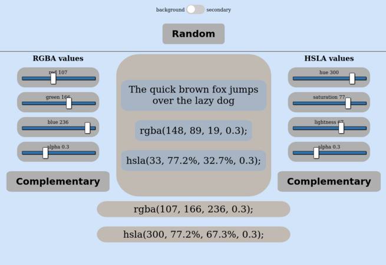

# color picker

Color picker with sliders for rgba and hsla values. The selected color is applied to the body background or to the middle section background if the checkbox is checked. The selected values are displayed for easy copy paste. The complementary buttons add the complementary color to the other element to see them side by side. 

## LICENSE

[mit licence](./LICENSE)
